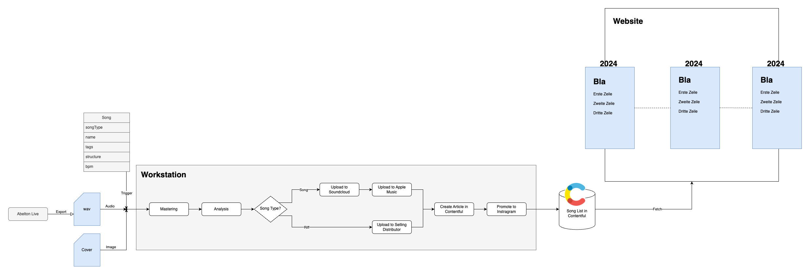

# 🎧 Workstation

`Express App Server to help improve daily life.`

| Version | Topic      | Feature        | Description                                                                                                    |
| ------- | ---------- | -------------- | -------------------------------------------------------------------------------------------------------------- |
| `/v1`   | `/music`   | `/samples`     | 🎉 Search for Samples and Upload them to your Google Drive                                                     |
| `/v1`   | `/music`   | `/suggestions` | 🎉 When writing Song Text, use the built-in dictionaries to get word suggestions for German, English & French  |
| `/v1`   | `/music`   | `/rhymes`      | 🛠️ When writing Song Text, use the built-in rhyme engine to get rhyme suggestions for German, English & French |
| `/v1`   | `/music`   | `/snippets`    | 🛠️ tbd                                                                                                         |
| `/v1`   | `/planner` | `/`            | 🎉 Automated Arranging of Apple Reminder Tasks to Google Calendar                                              |

# Music

`Everythings music creation related.`

# Song-Creation-Process

The process of releasing songs and riffs consists of four steps:

1. Creating and exporting the song to Google Cloud
2. Triggering Processing of the song via Workstation Server
3. Upload results to Contentful as main content database
4. Website to display songs aside from upload to streaming platforms



# Testing

Scripts are present for local testing in watch mode or in a ci environment.
All Tests are located in `src/tests/*` and need to be transpiled from TypeScript to JavaScript before execution.

## Local Testing

Open two terminals an execute in the first one the transpilation from TypeScript to JavaScript via `tsc`.

```sh
yarn build --watch
```

In the other terminal run the test script which simulates a Jest oriented testing but only uses the native NodeJS Test Runner.

```sh
yarn test
```

## Testing in CI

Two scripts exists testing the code with or without code coverage.

```sh
yarn test:ci
yarn test:coverage
```
